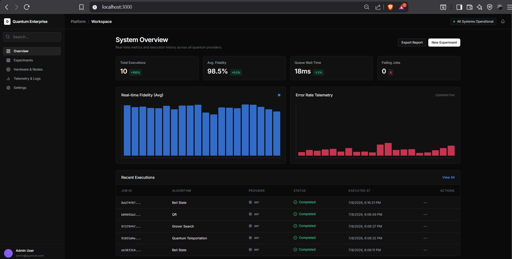
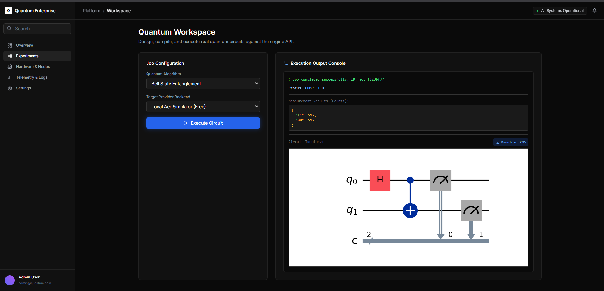
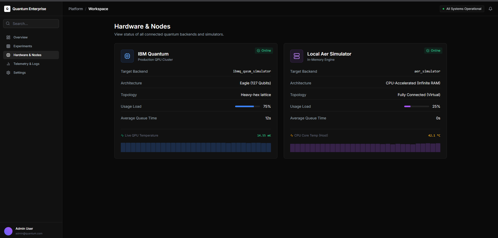

# ⚛️ Quantum Platform Enterprise (Mini Project 2)


Quantum Platform Enterprise is a modern, full-stack quantum computing management dashboard built for **Mini Project 2**. It provides an intuitive, real-time command center for researchers to manage quantum jobs, monitor QPU hardware telemetry, and visualize quantum circuits using enterprise-grade UI components.

## 🌟 Key Features

*   **Real-time Quantum Telemetry**: Live tracking of QPU temperatures, decoherence error rates, and queue loads using animated sparklines.
*   **High-Fidelity Circuit Rendering**: Native integration with IBM Qiskit `matplotlib` drawer for professional, color-coded quantum circuit topology export (PNG).
*   **State Machine Execution Engine**: Reliable transition of quantum jobs (Draft ➔ Queued ➔ Running ➔ Completed) managed via FastAPI background tasks.
*   **Enterprise Dashboard**: Live Data-driven KPIs, execution history, and analytical telemetry.

---

## 📸 Platform Previews

### 1. System Overview Dashboard
Live KPI tracking, fidelity telemetry graphs, and real-time backend-connected execution history.


### 2. Quantum Workspace
Design, compile, and execute real quantum algorithms (Bell State, Grover, QFT, VQE) with direct high-quality Qiskit circuit rendering.


### 3. Hardware & Nodes Telemetry
Live tracking of QPU core temperatures, architecture specs (Eagle 127-Qubit), and heavy-hex lattice topology data.


*(Note: To display the images above, please place the screenshot files in the `docs/assets/` folder and name them `dashboard.png`, `workspace.png`, and `hardware.png` respectively.)*

---

## 🛠️ Tech Stack

### Frontend
*   **Framework:** Next.js 14 (App Router)
*   **Styling:** Tailwind CSS + Framer Motion (for animations)
*   **Icons:** Lucide React

### Backend
*   **Framework:** FastAPI (Python)
*   **Database:** SQLite (Async SQLAlchemy)
*   **Quantum Engine:** Qiskit + Matplotlib (for circuit visualization)

---

## 🚀 Quick Start Guide

### 1. Start the Backend
```bash
cd backend
python -m venv venv
venv\Scripts\activate
pip install -r requirements.txt
python -m uvicorn main:app --reload --port 8000
```

### 2. Start the Frontend
```bash
cd frontend
npm install
npm run dev
```

Visit `http://localhost:3000` to access the Quantum Platform Enterprise.

---

## 🤝 Contribution & License
Built for **Project Q 30-Days Challenge - Mini Project 2**. All rights reserved.
