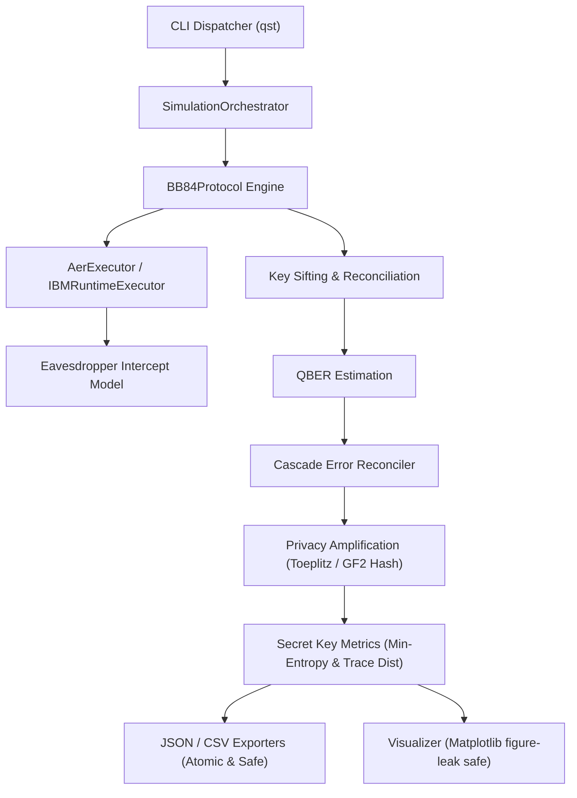

# QST v1.0.0 Release

## Release Summary

The **Quantum Security Toolkit (QST) v1.0.0** is a modular, research-oriented Python toolkit for simulating and analyzing Quantum Key Distribution (QKD) protocols. Centered around Bennett-Brassard 1984 (BB84), QST provides an end-to-end software testbed spanning quantum state preparation, channel eavesdropping dynamics, key sifting, error estimation, multi-pass Cascade error correction, and 2-universal privacy amplification.

This release represents the frozen, validated baseline for the v1.0 series, following an exhaustive engineering quality gate, static analysis audit, and formal release verification.

---

## Major Capabilities

1. **BB84 Protocol Engine**:
   - Quantum state preparation across computational ($Z$) and Hadamard ($X$) bases.
   - Projective measurement and public basis reconciliation sifting.
   - Sifted key yield tracking and error identification.
2. **Eavesdropping Simulation**:
   - Active Eve intercept-resend attack modeling with configurable probability ($0.0 \le p \le 1.0$).
   - Demonstration of quantum measurement collapse inducing detectable error rates.
3. **QBER Estimation**:
   - Precision Quantum Bit Error Rate calculation with statistical confidence diagnostics.
   - Security classification thresholds (Secure vs. Compromised).
4. **Cascade Error Correction**:
   - Multi-pass recursive parity reconciliation using binary search error localization.
   - Dynamic block size scheduling and error correction efficiency reporting.
5. **Privacy Amplification**:
   - Information-theoretic privacy amplification via 2-universal hash functions:
     * Toeplitz matrix hashing.
     * Carter-Wegman strongly 2-universal affine matrix family over $\text{GF}(2)$.
   - Shannon entropy, min-entropy $H_\infty(X)$, and trace distance security bound calculation.
6. **Execution Backends**:
   - Local Qiskit Aer simulation with adaptive Clifford stabilizer routing for up to 2,048 qubits.
   - Remote IBM Quantum QPU execution via IBM Quantum Runtime with automatic Aer fallback.
7. **Telemetry & Visual Analytics**:
   - Atomic, path-traversal-safe JSON and CSV telemetry exporters.
   - Matplotlib visualization backend supporting Line, Scatter, Histogram, and Heatmap plots.
8. **Command Line Interface**:
   - Comprehensive CLI commands for single trials (`simulate`), multi-dimensional grids (`sweep`), data export (`export`), and plotting (`visualize`).

---

## Engineering Improvements

During the v1.0 hardening cycle, significant technical debt was eliminated:
- **Stabilizer Method Dynamic Routing**: Qiskit Aer's default statevector method is limited by exponential memory scaling ($2^N \times 16$ bytes). Clifford BB84 circuits are now dynamically routed to `method="stabilizer"`, enabling simulation of up to 2,048 qubits with polynomial memory.
- **Figure Leak Prevention**: Fixed Matplotlib canvas memory leaks by enforcing `plt.close(fig)` inside `finally` blocks within `MatplotlibBackend`, guaranteeing zero retained figures during batch sweeps.
- **Reflection Elimination**: Removed runtime `inspect.signature` inspection from protocol dispatch, establishing a clean, explicit `ProtocolInterface.initialize` contract.
- **Structured Logging**: Fully wired Python's logging subsystem to output structured log events with timestamps, log levels, and standard error classification codes (`QST-VAL-*`).
- **Property-Based Testing**: Migrated Hypothesis test suites from pseudo-random loops to genuine `@given` strategies with reproducible test generation.
- **CI / Packaging Integrity**: Configured GitHub Actions test workflow to install visualization extras (`pip install -e ".[viz]"`), and registered custom pytest markers in `pyproject.toml`.

---

## Security Improvements

- **Path Traversal Defense (`QST-VAL-405`)**: Both `JSONExporter` and `CSVExporter` validate target destination paths, blocking directory traversal sequences (`..`), null-byte injections (`\0`), and extension tampering.
- **Atomic File Writes**: All exports utilize OS temporary file descriptors (`mkstemp`), flush buffers to non-volatile storage (`os.fsync`), and atomically replace target files (`os.replace`), preventing partial or corrupted outputs.
- **Resource & Memory Estimation (`QST-VAL-103`, `QST-VAL-104`)**: The simulation dispatcher pre-calculates estimated memory requirements based on the chosen backend and enforces a configurable ceiling (`MAX_SIMULATION_QUBITS = 2048`). Requests exceeding 28 qubits on statevector backends or 80% available system RAM are cleanly blocked before execution.
- **Strongly 2-Universal Hashing**: Replaced stub implementations with a complete Carter-Wegman affine matrix hash family over $\text{GF}(2)$, satisfying information-theoretic privacy amplification bounds.

---

## Testing & Quality

QST v1.0 has been independently audited and verified against strict release gates:

| Quality Gate | Requirement | Measured Result | Status |
| :--- | :--- | :--- | :---: |
| **Unit & Integration Tests** | 100% Pass Rate | **229 passed, 0 failed** across 54 test modules | **PASS** |
| **Code Coverage** | $\ge 90\%$ Target | **97% Total Coverage** (2,497 / 2,575 statements in `src/qst`) | **PASS** |
| **Linter Compliance** | 0 Ruff Errors | **0 errors** (`ruff check src tests`) | **PASS** |
| **Type Checking** | Strict Mypy Mode | **0 errors** across 98 source files (`mypy src`) | **PASS** |
| **Stress Scalability** | Up to 2048 Qubits | 2048 qubits simulated in 4.1s; >2048 cleanly rejected | **PASS** |

---

## CLI Demonstrations

The CLI interface supports reproducible workflows:

```bash
# 1. Basic BB84 Simulation
qst simulate --qubits 20 --seed 42

# 2. Eve Intercept-Resend Demonstration
qst simulate --qubits 50 --seed 42 --interception-probability 0.5

# 3. Full 9-Stage Pipeline with Cascade and Privacy Amplification
qst simulate --qubits 100 --seed 42 --interception-probability 0.1 \
    --error-correction --privacy-amplification --output trial.json

# 4. Multi-Dimensional Parameter Sweep
qst sweep --qubits 20,40 --probabilities 0.0,0.2 --repetitions 2 --export sweep.json

# 5. Scientific Visualization Generation
qst visualize --type LINE --output qber_trend.png sweep.json

# 6. Telemetry Data Export
qst export --format CSV --output report.csv trial.json
```

---

## Architecture



---

## Known Limitations

To maintain absolute academic transparency, the following limitations are documented:
1. **Software Simulation**: QST is a classical software simulator; it does not interface with physical single-photon detectors or fiber-optic links.
2. **Eve Interception Abstraction**: Current Eve intercept-resend behavior is modeled by classically altering bases and states prior to circuit execution.
3. **Physical Side Channels**: Hardware-specific physical attacks (detector saturation, timing side channels, optical Trojan-horse reflections) are outside the software scope.

---

## Research Roadmap

### Completed in v1.0
- [x] Full BB84 protocol simulation (state preparation, sifting, QBER).
- [x] Cascade error correction with binary search parity localization.
- [x] Toeplitz and Carter-Wegman strongly 2-universal hash privacy amplification.
- [x] IBM Quantum Runtime integration with automatic Aer fallback.
- [x] Parameter sweep engine with multi-format telemetry and visualizations.
- [x] Strict static quality gate: 229 tests, 97% coverage, Ruff clean, Mypy clean.

### Roadmap Item: `QST-ROADMAP-001`
- **Title**: Quantum-Native Mid-Circuit Measurement and Density-Matrix Channel Models.
- **Description**: Transition Eve eavesdropping simulation from pre-circuit classical state modification to genuine mid-circuit quantum measurement (`measure_and_reset`) and open-system density-matrix noise channels (Kraus operators, depolarizing channels) directly on Qiskit circuit representations.
- **Target**: QST Phase 1.5 / 2.0 research cycle.

---

## Release Validation

- **Release Gate Assessment**: Independent audit completed on 2026-09-10.
- **Test Integrity**: All 229 tests independently executed and verified.
- **Codebase Cleanliness**: Zero temporary scratch files, zero circular imports, zero unhandled figure handles.
- **Verdict**: **RELEASE READY — APPROVED FOR FREEZE**.

---

## Version

**v1.0.0** (Release Date: September 2026)
