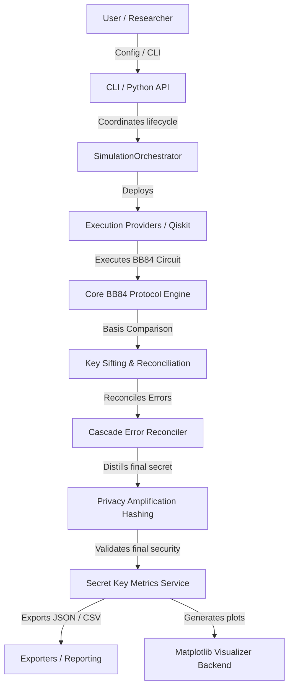
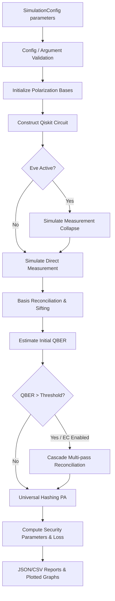

# 🌌 Quantum Security Toolkit (QST)

<p align="center">
  
</p>

<p align="center">
  <strong>A modular, enterprise-grade simulation, analysis, and validation framework for Quantum Key Distribution (QKD) protocols.</strong>
</p>

<p align="center">
  QST allows security researchers, network engineers, and students to model quantum networks, evaluate the impact of eavesdroppers, and run statistical parameter sweeps in clean, reproducible environments.
</p>

<p align="center">
  <a href="https://www.python.org/"></a>
  <a href="./LICENSE"></a>
  <a href="#"></a>
  <a href="#"></a>
  <a href="#"></a>
  <a href="#"></a>
  <a href="https://github.com/psf/black"></a>
  <a href="#-documentation-hub"></a>
</p>

<p align="center">
  <a href="#-quick-start"><strong>Quick Start</strong></a> |
  <a href="#-example-outputs"><strong>Example Outputs</strong></a> |
  <a href="#-installation"><strong>Installation</strong></a> |
  <a href="#-architecture-diagram"><strong>Architecture</strong></a> |
  <a href="#-examples"><strong>Examples</strong></a> |
  <a href="#-documentation-hub"><strong>Documentation</strong></a> |
  <a href="./Docs/API_Reference.md"><strong>API Reference</strong></a> |
  <a href="#-cli-showcase"><strong>CLI</strong></a> |
  <a href="./CONTRIBUTING.md"><strong>Contributing</strong></a> |
  <a href="./LICENSE"><strong>License</strong></a> |
  <a href="#-citation"><strong>Citation</strong></a> |
  <a href="#-project-roadmap"><strong>Roadmap</strong></a>
</p>

---

## 🗺️ Table of Contents
1. [📖 Introduction](#-introduction)
2. [🚀 Quick Start](#-quick-start)
3. [📸 Example Outputs](#-example-outputs)
4. [📂 Documentation Hub](#-documentation-hub)
5. [🌟 Feature Highlights](#-feature-highlights)
6. [📷 Screenshots & Visual Showcase](#-screenshots--visual-showcase)
7. [📐 Architecture Diagram](#-architecture-diagram)
8. [🔄 Project Workflow](#-project-workflow)
9. [📂 Project Structure](#-project-structure)
10. [📦 Installation](#-installation)
11. [💻 CLI Showcase](#-cli-showcase)
12. [🐍 Python API Usage](#-python-api-usage)
13. [📚 Examples](#-examples)
14. [⚙️ Configuration](#-configuration)
15. [🏛️ Architecture Overview](#%EF%B8%8F-architecture-overview)
16. [🛠️ Technology Stack](#%EF%B8%8F-technology-stack)
17. [📊 Benchmarks](#-benchmarks)
18. [📅 Project Roadmap](#-project-roadmap)
19. [🤝 Contributing](#-contributing)
20. [🛡️ Security](#%EF%B8%8F-security)
21. [🧪 Testing](#-testing)
22. [📅 Release Information](#-release-information)
23. [🏷️ Citation](#%EF%B8%8F-citation)
24. [📜 License](#-license)
25. [💖 Acknowledgements](#-acknowledgements)
26. [✉️ Footer](#%EF%B8%8F-footer)

---

## 📖 Introduction

The **Quantum Security Toolkit (QST)** is designed to simulate the BB84 QKD protocol under real-world noise parameters and active eavesdropper intercepts. 

### Why QST?
* **Dual Execution Modes:** Execute Qiskit circuits locally using high-performance `AerSimulator` backends or route them to real remote QPUs via the **IBM Quantum Runtime**.
* **Automatic Fallback:** Gracefully recovers from overloaded remote queues by falling back to local simulation.
* **Noise-Aware Local Simulation:** Automatically pulls hardware calibration properties from remote IBM backends to model physical qubit errors locally.
* **Extensible & Scientific:** Designed to evaluate post-processing protocols like Cascade error correction and 2-universal Toeplitz privacy amplification.

---

## 🚀 Quick Start

Run your first BB84 simulation trial in under 30 seconds:

### 1. Install QST
```bash
git clone https://github.com/shlok926/Project-Q-30-Days-Challenge.git
cd "Project-Q-30-Days-Challenge/Mini_Project_3/Quantum Security Toolkit (QST)"
python -m venv .venv
source .venv/bin/activate  # Windows: .venv\Scripts\activate
pip install -e ".[viz]"
```

### 2. Execute via Python
Create a script (e.g. `quickstart.py`):
```python
from qst.models.config import SimulationConfig
from qst.orchestration.orchestrator import SimulationOrchestrator

config = SimulationConfig(n_qubits=20, seed=42)
orchestrator = SimulationOrchestrator()
result = orchestrator.run_once(config)
trial = result.simulations[0]

print(f"Sifted Key length: {trial.final_key_length}")
print(f"Computed QBER:     {trial.qber}")
```
Execute:
```bash
python quickstart.py
```

### 3. Execute via CLI
```bash
qst simulate --qubits 20 --seed 42 --output trial.json
```

---

## 📸 Example Outputs

This section showcases the real visual outputs produced by the toolkit's simulation and visualizer pipelines, illustrating the scientific plots generated during execution.

### Example 05 — QBER Trend Analysis

This plot illustrates the relationship between the observed Quantum Bit Error Rate (QBER) and the interception probability of the eavesdropper (Eve). It demonstrates the linear growth in transition errors caused by state collapses under measurement intercepts, helping researchers benchmark detection limits.


#### What this demonstrates
* Alice/Bob polarization basis sifting reconciliation yields.
* Statistical tracking of the Quantum Bit Error Rate (QBER) in transit.
* Eavesdropper measurement collapse simulation with custom probabilities.
* Visual verification of detection thresholds in the quantum channel.
* Generation of publication-ready scientific vector graphics (PNG/SVG/PDF).

---

### Example 05 (Continued) — Heatmap Matrix Visualization

This chart visualizes QBER occurrences across different key segments and blocks. It provides spatial profiling of error distributions, helping to evaluate block size selections for post-processing error correction algorithms.


#### What this demonstrates
* Spatial distribution of error density across key blocks.
* Profiling of error locations to detect correlation in intercepts.
* Telemetry mapping for Cascade block size optimization parameters.
* Graphical validation of parity check matrices distributions.

---

### Example 06 — Complete Pipeline Sweep

This plot represents the end-to-end parameter sweep tracking overall secret key rate and QBER trends. It details key rate attenuation and error margins as interception levels increase.


#### What this demonstrates
* End-to-end QKD pipeline simulation (Raw → Sifted → Corrected → Final Secret Key).
* Key rate attenuation trends under active eavesdropper interference.
* Cascade Error Correction efficiency threshold benchmarks.
* Privacy Amplification key compression ratio limits.
* Protocol loss analysis tracking (raw, sifted, corrected, final).
* Execution backend profiling across simulated parameters.

---

## 📂 Documentation Hub

Detailed guides, tutorials, and specifications are organized in the `Docs/` directory:

| Guide | Purpose | Target Audience |
| :--- | :--- | :--- |
| 📖 **[User Guide](./Docs/User_Guide.md)** | Getting started, CLI parameters, and code configuration guides. | QKD students and software developers. |
| 📐 **[Architecture](./Docs/Architecture.md)** | Core simulation designs and pipeline data flow specifications. | Systems and quantum software architects. |
| 📝 **[API Reference](./Docs/API_Reference.md)** | Frozen configurations classes and public method signatures. | API clients and package integrators. |
| 🛠️ **[Troubleshooting](./Docs/Troubleshooting.md)** | Resolving `QST-VAL-*` and `QST-SIM-*` error codes. | Sysadmins and execution pipeline reviewers. |
| 📊 **[Benchmark Report](./Docs/Benchmark_Report.md)** | CPU execution timings, memory metrics, scaling characteristics. | Research software engineers. |
| 📅 **[Roadmap](./Docs/Roadmap.md)** | Development milestones achievements and future updates path. | Contributors and release managers. |
| ❓ **[FAQ](./Docs/FAQ.md)** | Common questions on backend selections and simulation sizes. | General toolkit users. |

---

## 🌟 Feature Highlights

| Feature | Category | Icon | Description |
| :--- | :--- | :---: | :--- |
| **BB84 Engine** | Quantum Core | ⚛️ | Quantum polarization preparation and measurements. |
| **IBM QPU Integration** | Backend Router | 🌐 | Real hardware execution and automatic Aer fallbacks. |
| **Cascade Error Correction** | Reconciliation | 🧩 | Multi-pass recursive key error correction. |
| **Privacy Amplification** | Cryptography | 🔒 | 2-universal Toeplitz hashing compression. |
| **Scientific Visualizer** | Analytics | 📈 | Matplotlib plotting backend supporting PNG, SVG, PDF. |
| **CLI Showcase** | Executables | 💻 | CLI commands to simulate and parameter sweep. |
| **JSON/CSV Export** | Telemetry | 📂 | Full serialization formatters and export utilities. |
| **Parameter Sweeps** | Benchmarking | 📊 | Sweep parameter grids for trend analysis. |
| **Modular SOLID Architecture** | Code Quality | 🏗️ | Dependency inversion using clean abstractions. |

---

## 📷 Screenshots & Visual Showcase

### CLI Demonstration
*Placeholder for terminal recording showing CLI execution flow:*
```text
[Future GIF Placeholder: qst simulate execution flow]
```

### Visual Showcase Cards
*Placeholders for generated visualization outputs:*
```text
┌───────────────────────────────────────┐  ┌───────────────────────────────────────┐
│        [Matplotlib QBER Plot]         │  │       [Parameter Sweep Trends]        │
│                                       │  │                                       │
│  Line plot showing rising QBER under  │  │   Heatmap matrix illustrating key     │
│  eavesdropper interception levels.    │  │   yields across noise parameters.     │
└───────────────────────────────────────┘  └───────────────────────────────────────┘
┌───────────────────────────────────────┐  ┌───────────────────────────────────────┐
│       [Security Metrics Cards]        │  │       [Exported Report Outputs]       │
│                                       │  │                                       │
│  Classification levels (LOW/MED/HIGH) │  │  Structured JSON and CSV reports with │
│  based on trace distance bounds.      │  │  deterministic simulation results.    │
└───────────────────────────────────────┘  └───────────────────────────────────────┘
```

---

## 📐 Architecture Diagram

The diagram below outlines the structural boundaries and dependency flows between QST modules:



---

## 🔄 Project Workflow

The following flowchart explains the logical execution pipeline from configurations validation to output serialization:



---

## 📂 Project Structure

```text
qst/
├── .github/
│   ├── workflows/            # GitHub actions for build, test, lint, and security scan
│   ├── ISSUE_TEMPLATE/       # Templates for bug reports and feature requests
│   └── pull_request_template.md
├── Docs/                     # Detailed guides and manuals
├── src/qst/
│   ├── core/                 # Quantum circuits, sifting, QBER, and Eve simulation
│   ├── correction/           # Cascade error correction algorithms and parity models
│   ├── privacy/              # Toeplitz hashing and Min-Entropy estimations
│   ├── secret/               # Rates metrics calculators and summary builders
│   ├── orchestration/        # Run schedulers and parameter sweep loops
│   ├── reporting/            # CSV, JSON exporters and serializers
│   ├── visualization/        # Themes registry and Matplotlib rendering backend
│   └── cli/                  # CLI commands entrypoints
├── tests/                    # Unit, integration, property, and benchmark suites
├── examples/                 # Execution tutorials
├── notebooks/                # Jupyter notebook tutorials
└── pyproject.toml            # Package metadata and PEP-518 dependencies
```

---

## 📦 Installation

### 1. Operating System Targets
QST is verified across:
* **Windows 10 / 11**
* **Linux (Ubuntu, Debian, CentOS)**
* **macOS (Intel and Apple Silicon)**

### 2. Standard Installation
Create a virtual environment and install QST in editable mode:
```bash
python -m venv .venv
source .venv/bin/activate  # Windows: .venv\Scripts\activate
pip install -e .
```

### 3. Full Installation (with Visualization features)
To enable vector scientific plot exports:
```bash
pip install -e ".[viz]"
```

---

## 💻 CLI Showcase

Exposes command line utilities to simulate trials, parameter sweeps, and export telemetry formats:

### Generate Help Menu
```bash
qst --help
```

### Run Trial Simulation
```bash
qst simulate --qubits 20 --seed 42 --interception-probability 0.05 --output trial.json
```

### Run Parameters Sweeps
```bash
qst sweep --qubits 10,20 --interception 0.0,0.1,0.2 --output sweep.json
```
*Expected Output Format:* Logs simulation counts, sifting durations, QBER calculations, and writes outcome results to the target path.

---

## 🐍 Python API Usage

```python
from qst.models.config import SimulationConfig
from qst.correction.models import CascadeConfiguration
from qst.privacy.models import PrivacyAmplificationConfiguration
from qst.orchestration.orchestrator import SimulationOrchestrator

# Initialize comprehensive configuration
config = SimulationConfig(
    n_qubits=30,
    seed=42,
    run_error_correction=True,
    cascade_configuration=CascadeConfiguration(block_sizes=(8, 16)),
    run_privacy_amplification=True,
    privacy_configuration=PrivacyAmplificationConfiguration(compression_ratio=0.6)
)

orchestrator = SimulationOrchestrator()
result = orchestrator.run_once(config)

trial = result.simulations[0]
print(f"Corrected Key: {trial.corrected_key}")
print(f"Final Secret Key: {trial.final_secret_key.key_bits}")
print(f"Min-Entropy Parameter: {trial.final_secret_key.min_entropy_estimate}")
```

---

## 📚 Examples

| Tutorial Script | Difficulty | Est. Time | Key Concepts Demonstrated |
| :--- | :--- | :--- | :--- |
| [`01_basic_bb84.py`](./examples/01_basic_bb84.py) | Beginner | 2 mins | Config initialization, orchestrator run_once, console reporting |
| [`02_eavesdropper_demo.py`](./examples/02_eavesdropper_demo.py) | Intermediate | 3 mins | Eavesdropping intercepts, quantum state collapse explanation, QBER rise |
| [`03_parameter_sweep.py`](./examples/03_parameter_sweep.py) | Intermediate | 4 mins | Config sweeps generation, sweeps execution, statistical aggregations |
| [`04_export_results.py`](./examples/04_export_results.py) | Intermediate | 3 mins | Serializers, JSONExporter, CSVExporter, schema load verification |
| [`05_visualization.py`](./examples/05_visualization.py) | Intermediate | 4 mins | Visualizer, MatplotlibBackend, themes, multi-format plots (PNG, SVG, PDF) |
| [`06_complete_pipeline.py`](./examples/06_complete_pipeline.py) | Advanced | 5 mins | E2E sweeps, trend analysis, scientific plotting, serialization, JSON/CSV exports |
| [`07_real_hardware_execution.py`](./examples/07_real_hardware_execution.py) | Intermediate | 3 mins | IBM Quantum Runtime execution, backend selection, and Aer fallback |
| [`08_error_correction.py`](./examples/08_error_correction.py) | Intermediate | 3 mins | Cascade Error Correction integration, key reconciliation metrics |
| [`09_privacy_amplification.py`](./examples/09_privacy_amplification.py) | Intermediate | 3 mins | Privacy Amplification, key compression ratio metrics, Min/Shannon Entropy |
| [`10_protocol_summary.py`](./examples/10_protocol_summary.py) | Intermediate | 3 mins | Protocol Finalization, E2E key rates summary, classification levels, and losses |

---

## ⚙️ Configuration

| Configuration Attribute | Type | Default | Description |
| :--- | :---: | :---: | :--- |
| `n_qubits` | `int` | *Required* | Number of raw qubits generated in the quantum polarization stage. |
| `seed` | `Optional[int]` | `None` | Seed value for deterministic pseudorandom matrix and block shuffles. |
| `interception_probability` | `float` | `0.0` | Probability that Eve intercepts and measures a qubit during transit. |
| `run_error_correction` | `bool` | `False` | Enables/disables the Cascade Error Correction process. |
| `run_privacy_amplification` | `bool` | `False` | Enables/disables the Privacy Amplification hashing stage. |
| `use_ibm_runtime` | `bool` | `False` | Routes circuit execution to remote IBM Quantum hardware when set to `True`. |

---

## 🏛️ Architecture Overview

The toolkit's modular packaging aligns with strict **SOLID design principles**:
* **Dependency Inversion:** Execution backends implement `ExecutorInterface`, allowing simulators (Aer) and physical hardware (IBM QPU Runtime) to be swapped transparently.
* **Single Responsibility:** Cryptographic, error reconciliation, and mathematical metric calculations are separated from runtime orchestration loops.
* **Interface Segregation:** Hashing algorithms inherit from the generic `HashAlgorithm` contract, isolating Toeplitz implementations.

---

## 🛠️ Technology Stack

| Component | Library / Framework | Version |
| :--- | :--- | :---: |
| **Language** | Python | `>=3.10` |
| **Quantum Physics Simulator** | Qiskit / Qiskit Aer | `>=1.0.0` |
| **Array Computing** | NumPy | `>=1.24.0` |
| **Testing Backend** | pytest / pytest-cov | `>=7.0.0` |
| **Code Formatting** | black / ruff | Modern release |
| **Plotting Engine (Optional)** | Matplotlib | `>=3.7.0` |

---

## 📊 Benchmarks

*Measurements collected on Qiskit Aer statevector simulators (CPU: Intel i7 / Ryzen 7 equivalents):*

| Key Size (Qubits) | Execution Time (ms) | Peak Memory (KiB) |
| :--- | :---: | :---: |
| 5 | 3889.86 | 37471.42 |
| 10 | 577.50 | 265.70 |
| 15 | 544.66 | 249.99 |
| 20 | 626.51 | 239.79 |
| 25 | 1040.11 | 232.73 |

### Scalability Limits
* **Simulator Bounds:** Local simulations using standard coupling maps are bounded to $N \le 29$ qubits.
* **Transpiler Warning:** Requesting $N > 29$ qubits raises transpilation validation errors.

---

## 📅 Project Roadmap

### Completed Milestones
- [x] **Phase 1-11 (Foundations & CLI):** Polarization state preps, basis reconciliation sifting, visualizer registry, JSON/CSV sweeps, and command line tools.
- [x] **Phase 12 (IBM Integration):** Least-busy QPU discoverer, remote simulator execution, and automatic Aer fallbacks.
- [x] **Phase 13A (Cascade EC):** Multi-pass Cascade error correction.
- [x] **Phase 13B (Privacy Amplification):** 2-universal Toeplitz hashing matrices generators, Shannon/Min-entropy estimators, and trace distance bounds computations.
- [x] **Phase 13C (Protocol Finalization):** Dedicated calculators and summaries, security level thresholds.
- [x] **Phase 14 (Release Engineering):** Version freezes, packaging setup, supply-chain workflows, and complete guides.

---

## 🤝 Contributing

We welcome contributions to the Quantum Security Toolkit! Please read our [Contributing Guide](./CONTRIBUTING.md) and [Code of Conduct](./CODE_OF_CONDUCT.md) for details on code style guidelines, formatting, testing targets, and pull request submission steps.

---

## 🛡️ Security

Please review [`SECURITY.md`](./SECURITY.md) for information regarding vulnerability reporting channels and security disclosures policies.

---

## 🧪 Testing

Execute the test suites using pytest:
```bash
python -m pytest
```

Verify type annotations:
```bash
mypy src/
```

Verify formatting and linting:
```bash
black --check src/
ruff check src/
```

---

## 📅 Release Information

This project adheres to **Semantic Versioning (SemVer)**:
* **Stable public APIs** (defined in `Docs/API_Reference.md`) are frozen for the `v1.x` release series. No breaking modifications will be introduced.
* Detailed historical updates are tracked in the [`CHANGELOG.md`](./CHANGELOG.md).

---

## 🏷️ Citation

For academic or research citation, please reference the CITATION metadata:
```bibtex
@software{qst_toolkit,
  author = {QST Authors},
  title = {Quantum Security Toolkit (QST)},
  version = {1.0.0},
  year = {2026},
  url = {https://github.com/shlok926/Project-Q-30-Days-Challenge}
}
```
*Note: Refer to [`CITATION.cff`](./CITATION.cff) for full CFF formats.*

---

## 📜 License

This project is licensed under the MIT License - see the [`LICENSE`](./LICENSE) file for details.

---

## 💖 Acknowledgements
* IBM Qiskit and Qiskit Aer simulation teams.
* Charles Bennett and Gilles Brassard (BB84 Protocol inventors).
* Cascade error correction protocol research authors.

---

## ✉️ Footer

<p align="center">
  <a href="./LICENSE">License</a> | 
  <a href="#-documentation-hub">Documentation</a> | 
  <a href="./CHANGELOG.md">Latest Release</a> | 
  <a href="./CONTRIBUTING.md">Contributing</a> | 
  <a href="#-citation">Citation</a> | 
  <a href="https://github.com/shlok926/Project-Q-30-Days-Challenge">Repository</a>
</p>

<p align="center">
  Made with ❤️ by the Quantum Security Toolkit Authors. <br>
  © 2026 QST Authors. All rights reserved.
</p>
