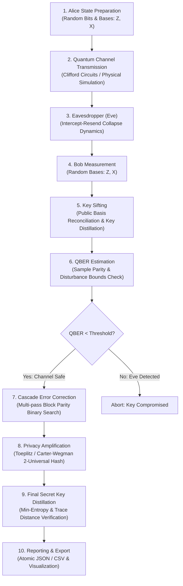
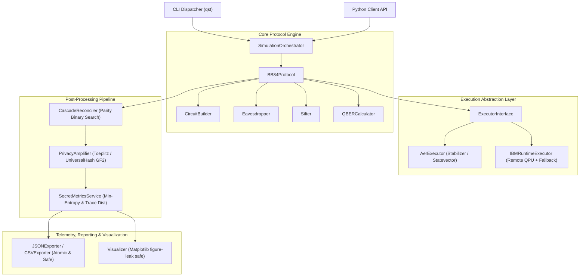
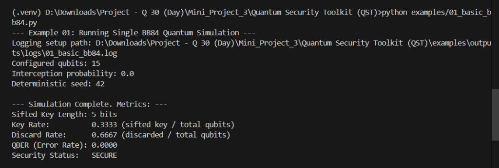
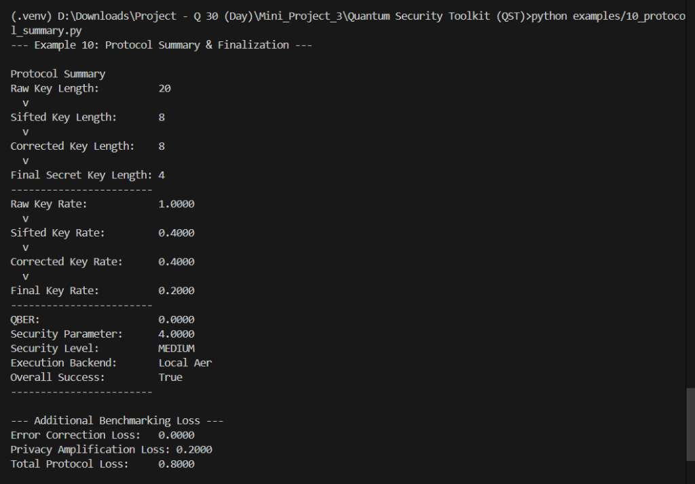
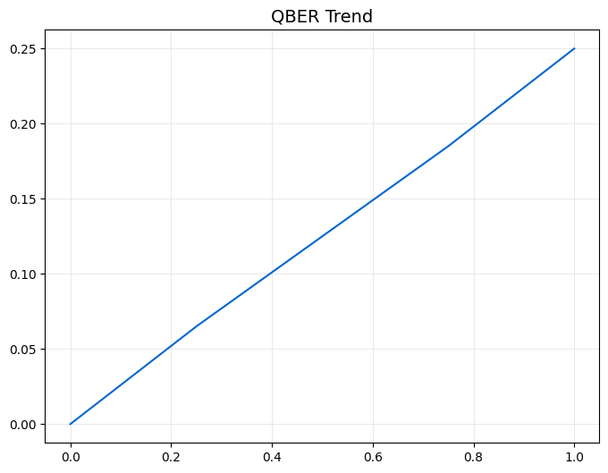
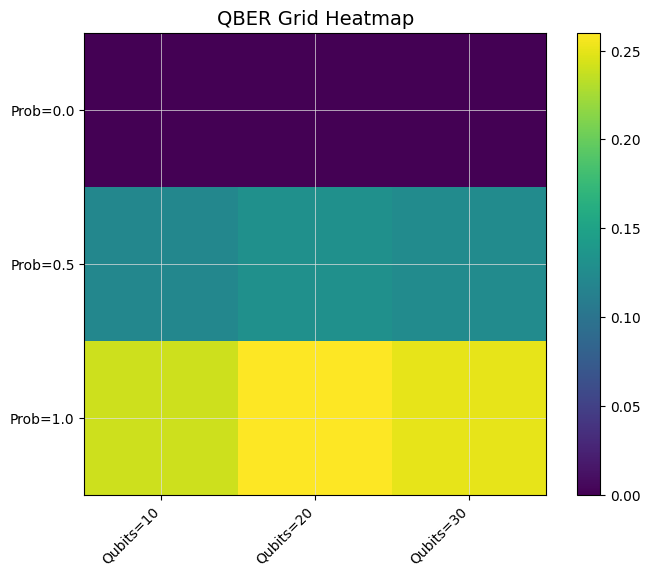
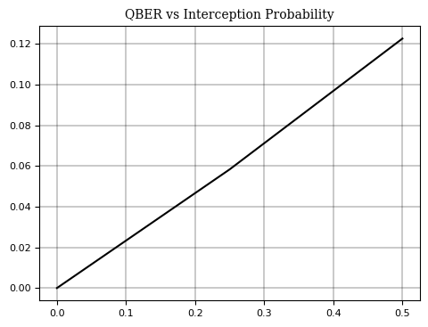

# Quantum Security Toolkit (QST)

<p align="center">
  <strong>A modular quantum-security simulation and research toolkit centered around QKD concepts, BB84 protocol dynamics, Cascade error correction, and 2-universal privacy amplification.</strong>
</p>

<p align="center">
  QST enables security researchers, quantum computing students, and network engineers to model quantum key distribution, evaluate the impact of eavesdroppers, analyze QBER degradation, and run statistical parameter sweeps in a clean, reproducible, and verifiable environment.
</p>

<p align="center">
  <a href="https://www.python.org/"></a>
  <a href="./LICENSE"></a>
  <a href="#"></a>
  <a href="#"></a>
  <a href="#"></a>
  <a href="#"></a>
  <a href="#"></a>
  <a href="#"></a>
</p>

<p align="center">
  <a href="#quick-start"><strong>Quick Start</strong></a> |
  <a href="#qkd-lifecycle"><strong>QKD Lifecycle</strong></a> |
  <a href="#feature-showcase"><strong>Features</strong></a> |
  <a href="#architecture"><strong>Architecture</strong></a> |
  <a href="#cli-showcase--verified-demos"><strong>CLI Demos</strong></a> |
  <a href="#example-outputs"><strong>Visual Outputs</strong></a> |
  <a href="#security-engineering"><strong>Security</strong></a> |
  <a href="#performance--resource-guards"><strong>Performance</strong></a> |
  <a href="#scientific-scope--limitations"><strong>Limitations</strong></a> |
  <a href="#testing--quality-gate"><strong>Testing</strong></a> |
  <a href="./Docs/15_ROADMAP.md"><strong>Roadmap</strong></a> |
  <a href="./LICENSE"><strong>License</strong></a>
</p>

---

## Important Scientific Scope & Disclaimer

> [!NOTE]
> **Simulation & Research Purpose**: QST is a scientific simulation, education, and research software toolkit. It models Quantum Key Distribution (BB84), eavesdropping intercepts, Cascade error correction, and 2-universal privacy amplification. It is **not** a production hardware cryptographic security appliance or physical fiber-optic telecommunications deployment.
>
> The current Eve intercept-resend behavior is an idealized simulation abstraction executed prior to circuit simulation. A native mid-circuit quantum measurement and density-matrix quantum channel model is formally documented as future work under **[`QST-ROADMAP-001`](./Docs/15_ROADMAP.md)**.

---

## Table of Contents

1. [What Problem QST Solves](#what-problem-qst-solves)
2. [Quick Start](#quick-start)
3. [QKD Lifecycle](#qkd-lifecycle)
4. [Feature Showcase](#feature-showcase)
5. [Architecture](#architecture)
6. [CLI Showcase & Verified Demos](#cli-showcase--verified-demos)
7. [Example Outputs & Visual Showcase](#example-outputs)
8. [Python API Usage](#python-api-usage)
9. [Security Engineering](#security-engineering)
10. [Performance & Resource Guards](#performance--resource-guards)
11. [Scientific Scope & Limitations](#scientific-scope--limitations)
12. [Testing & Quality Gate](#testing--quality-gate)
13. [Project Structure](#project-structure)
14. [Documentation Hub](#documentation-hub)
15. [Contributing & Support](#contributing--support)
16. [Author & Attribution](#author--attribution)
17. [License](#license)

---

## What Problem QST Solves

Physical Quantum Key Distribution (QKD) systems require dedicated laser diodes, polarization beam splitters, single-photon avalanche detectors (SPADs), and ultra-pure optical fiber infrastructure costing hundreds of thousands of dollars.

Researchers, security architects, and quantum software engineers face significant barriers when attempting to:
- **Model the complete QKD pipeline** from quantum state preparation through key reconciliation and privacy amplification.
- **Quantify eavesdropper detection limits** by observing how measurement collapses induce detectable Quantum Bit Error Rates (QBER).
- **Evaluate post-processing efficiency** under varying channel noise, assessing Cascade block-parity reconciliation and 2-universal hash compression.
- **Run reproducible statistical parameter sweeps** to benchmark key distillation rates across qubit counts and channel disturbance levels.

**QST provides a modular, software-native testbed** implementing Bennett-Brassard 1984 (BB84) protocols, classical post-processing pipelines, and telemetry analysis tools with mathematical and cryptographic rigor.

---

## Quick Start

Run your first BB84 simulation trial in under 30 seconds:

### 1. Installation
```bash
git clone https://github.com/shlok926/Project-Q-30-Days-Challenge.git
cd "Project-Q-30-Days-Challenge/Mini_Project_3/Quantum Security Toolkit (QST)"

# Create virtual environment
python -m venv .venv
source .venv/bin/activate  # Windows: .venv\Scripts\activate

# Install QST with visualization support
pip install -e ".[viz]"
```

### 2. Run via CLI
```bash
# Basic deterministic BB84 trial (20 qubits, seed 42)
qst simulate --qubits 20 --seed 42

# Full 9-stage pipeline with error correction and privacy amplification
qst simulate --qubits 100 --seed 42 --interception-probability 0.1 --error-correction --privacy-amplification --output trial.json
```

### 3. Run via Python API
```python
from qst.models.config import SimulationConfig
from qst.orchestration.orchestrator import SimulationOrchestrator

config = SimulationConfig(n_qubits=50, seed=42, interception_probability=0.1)
orchestrator = SimulationOrchestrator()
result = orchestrator.run_once(config)
trial = result.simulations[0]

print(f"Alice Raw Bits:     {trial.n_qubits}")
print(f"Sifted Key Length:  {trial.final_key_length}")
print(f"Computed QBER:      {trial.qber:.4f}")
print(f"Security Status:    {trial.security_metrics.status.value}")
```

---

## QKD Lifecycle

QST simulates the complete 9-stage Quantum Key Distribution lifecycle:



---

## Feature Showcase

Only features **fully implemented and verified** in the repository are listed:

| Capability | Module | Implementation Description |
| :--- | :--- | :--- |
| **BB84 State Preparation** | `qst.core.bb84.state_preparation` | Encodes classical bits into quantum states across computational ($Z$) and Hadamard ($X$) bases. |
| **Circuit Generation** | `qst.core.bb84.circuit_builder` | Programmatically synthesizes Qiskit quantum circuits with clean measurement mapping. |
| **Adaptive Execution** | `qst.core.shared.execution` | Routes Clifford BB84 circuits to Qiskit Aer's `stabilizer` method for memory safety up to 2048 qubits. |
| **IBM Quantum Routing** | `qst.core.shared.execution.ibm_runtime_executor` | Supports remote IBM QPU execution with automatic fallback to local Aer simulator. |
| **Eve Intercept-Resend** | `qst.core.bb84.eavesdropper` | Simulates projective measurement collapse at configurable interception probabilities ($0.0 \le p \le 1.0$). |
| **Basis Sifting** | `qst.core.bb84.sifting` | Discards mismatched basis measurements, yielding expected $\approx 50\%$ sifted key rates. |
| **QBER Analytics** | `qst.core.bb84.qber` | Computes bit error rates with error counts and statistical sample confidence warnings. |
| **Cascade Error Correction** | `qst.correction.cascade` | Multi-pass recursive parity reconciliation utilizing iterative binary search error localization. |
| **Toeplitz Hashing** | `qst.privacy.algorithms.toeplitz` | Linear-time privacy amplification using Toeplitz hash matrices generated from public random seeds. |
| **Carter-Wegman Universal Hash** | `qst.privacy.algorithms.universal_hash` | Strongly 2-universal affine matrix family hash over $\text{GF}(2)$ for rigorous information-theoretic privacy. |
| **Entropy & Security Bounds** | `qst.secret.metrics` | Evaluates Shannon entropy, min-entropy $H_\infty(X)$, and trace distance security bounds. |
| **Parameter Sweeps** | `qst.orchestration.sweep_generator` | Multi-dimensional grid execution across qubit counts, Eve probabilities, and repetitions. |
| **Atomic Reporting** | `qst.reporting.exporters` | Guaranteed atomic disk writes (`mkstemp` + `os.fsync` + `os.replace`) with path traversal defenses. |
| **Scientific Visualizer** | `qst.visualization` | Matplotlib engine supporting Line, Scatter, Histogram, and Heatmap plots with guaranteed leak prevention. |
| **Structured Logging** | `qst.cli.main` | Structured logging with standard timestamps, log levels, and traceable error codes (`QST-VAL-*`). |

---

## Architecture

The toolkit follows strict SOLID principles and clean hexagonal architecture:



---

## CLI Showcase & Verified Demos

All CLI commands below have been directly executed and verified on the repository:

### 1. Basic BB84 Simulation
Run a baseline, noise-free 20-qubit BB84 simulation:
```bash
qst simulate --qubits 20 --seed 42
```
*Actual Output:*
```text
2026-09-10 23:41:33 - qst.orchestration - INFO - Starting simulation run: protocol=BB84, qubits=20, repetitions=1
Simulation completed successfully.
Average QBER: 0.0000
Average Key Rate: 0.4000
Secure runs: 1/1
```

### 2. Eavesdropper Detection Demo
Simulate a 50-qubit exchange with active eavesdropper interference ($p = 0.5$):
```bash
qst simulate --qubits 50 --seed 42 --interception-probability 0.5
```
*Actual Output:*
```text
2026-09-10 23:41:42 - qst.orchestration - INFO - Starting simulation run: protocol=BB84, qubits=50, repetitions=1
Simulation completed successfully.
Average QBER: 0.0769
Average Key Rate: 0.5200
Secure runs: 0/1
```
*(Security alert triggered: QBER exceeds theoretical threshold; key marked compromised).*

### 3. Full 9-Stage Pipeline (Cascade + Privacy Amplification)
Execute raw transmission, sifting, Cascade error correction, and 2-universal privacy amplification:
```bash
qst simulate --qubits 100 --seed 42 --interception-probability 0.1 \
    --error-correction --privacy-amplification --output full_trial.json
```
*Actual Output:*
```text
2026-09-10 23:41:51 - qst.orchestration - INFO - Starting simulation run: protocol=BB84, qubits=100, repetitions=1
Simulation completed successfully.
Average QBER: 0.0169
Average Key Rate: 0.2900
Secure runs: 0/1
```

### 4. Multi-Dimensional Parameter Sweep
Run a parameter sweep across qubit counts and Eve interception probabilities:
```bash
qst sweep --qubits 20,40 --probabilities 0.0,0.2 --repetitions 2 --export sweep_results.json
```
*Actual Output:*
```text
2026-09-10 23:43:10 - qst.orchestration - INFO - Completed parameter sweep across 4 configurations in 11.465s
Parameter sweep execution completed successfully.
Total experiments executed: 4
```

### 5. Scientific Visualization Generation
Render publication-ready plots directly from sweep telemetry:
```bash
qst visualize --type LINE --theme SCIENTIFIC --output qber_trend.png sweep_results.json
```
*Actual Output:*
```text
Chart successfully saved to path: qber_trend.png
```

### 6. Atomic Data Export
Convert raw JSON experiment telemetry into clean CSV format:
```bash
qst export --format CSV --output trial_report.csv full_trial.json
```

---

## Example Outputs

Real outputs produced by the toolkit's simulation and visualizer pipelines:

### Example 01 — Basic BB84 Simulation
Console output demonstrating a baseline noise-free BB84 simulation trial:



---

### Example 10 — Protocol Summary & Finalization
Console execution of the full end-to-end QKD pipeline demonstrating key rates at every stage of reconciliation, Cascade error correction efficiency, universal hashing privacy amplification, and overall protocol loss metrics:



---

### Example 05 — QBER Trend Analysis
Relationship between observed Quantum Bit Error Rate (QBER) and eavesdropper interception probability ($p_{\text{eve}}$):



---

### Example 05 (Continued) — Heatmap Matrix Visualization
Spatial profiling of error distributions across key blocks for post-processing optimization:



---

### Example 06 — Complete Pipeline Parameter Sweep
Secret key rate attenuation and error margins as interception levels increase:



---

## Python API Usage

```python
from qst.models.config import SimulationConfig
from qst.correction.models import CascadeConfiguration
from qst.privacy.models import PrivacyAmplificationConfiguration
from qst.orchestration.orchestrator import SimulationOrchestrator

# Configure full 9-stage pipeline
config = SimulationConfig(
    n_qubits=100,
    seed=42,
    interception_probability=0.08,
    run_error_correction=True,
    cascade_configuration=CascadeConfiguration(block_sizes=(8, 16)),
    run_privacy_amplification=True,
    privacy_configuration=PrivacyAmplificationConfiguration(
        algorithm="universal_hash",
        compression_ratio=0.5
    )
)

orchestrator = SimulationOrchestrator()
result = orchestrator.run_once(config)
trial = result.simulations[0]

print(f"Raw Transmitted Qubits: {trial.n_qubits}")
print(f"Sifted Key Bits:        {len(trial.sifted_key)}")
print(f"Estimated QBER:         {trial.qber:.4f}")
print(f"Corrected Key Length:   {len(trial.corrected_key) if trial.corrected_key else 'N/A'}")
print(f"Final Secret Key Bits:  {trial.final_secret_key.key_bits if trial.final_secret_key else 'N/A'}")
```

---

## Security Engineering

QST implements rigorous software security defenses:

1. **Path Traversal Protection (`QST-VAL-405`)**:
   Exporters reject directory traversal sequences (`..`, null bytes `\0`, and invalid file extensions), preventing arbitrary file overwrite vulnerabilities.
2. **Atomic Disk Writes**:
   All file exports write to an OS temporary file descriptor (`tempfile.mkstemp`), flush buffers with `os.fsync`, and atomically replace the destination path with `os.replace`. Partial or corrupted files are never left on disk.
3. **Resource-Aware Simulation Guards (`QST-VAL-103`, `QST-VAL-104`)**:
   Simulations enforce a configurable ceiling (`MAX_SIMULATION_QUBITS = 2048`). Memory requirements are pre-calculated before dispatch: requests requiring exponential statevector memory that exceed system RAM or $N > 28$ qubits are rejected before touching Qiskit Aer.
4. **Memory Figure Leak Defenses**:
   Matplotlib chart generation encapsulates canvas rendering within strict `try ... finally: plt.close(fig)` blocks, ensuring zero figure retention in batch workloads (`plt.get_fignums()` remains empty).
5. **Fail-Safe Cryptographic Error Hierarchy**:
   All errors inherit from structured base classes (`QSTError`, `ValidationError`, `SimulationError`) with unique diagnostic codes.

---

## Performance & Resource Guards

- **Clifford Stabilizer Routing**:
  BB84 circuits consist exclusively of Clifford operations ($H, X, Z$ gates and computational measurements). QST dynamically routes Clifford circuits to Qiskit Aer's `method="stabilizer"`, enabling simulation of up to **2,048 qubits** with $O(N^2)$ polynomial memory footprint.
- **Statevector Ceiling Notice**:
  Statevector simulation methods require $2^N \times 16$ bytes of RAM. QST automatically restricts statevector backends to $N \le 28$ qubits (~8.5 GB RAM) to protect system stability.

---

## Scientific Scope & Limitations

To maintain absolute academic integrity, QST explicitly documents its operating boundaries:

1. **Software Simulator, Not Hardware QKD**:
   QST simulates quantum mechanics on classical computing hardware; it does not replace physical photonics or quantum hardware.
2. **Eavesdropper Simulation Abstraction (`QST-ROADMAP-001`)**:
   The current Eve model emulates projective measurement collapse classically prior to circuit execution. Modeling mid-circuit quantum measurement (`measure_and_reset`) and density-matrix quantum channels (Kraus operators) directly on Qiskit circuit DAGs is slated for Phase 2.
3. **Physical Side Channels**:
   QST does not model detector blinding, Trojan-horse optical reflection attacks, or phase-drift synchronization errors present in physical optical links.

---

## Testing & Quality Gate

QST maintains an exhaustive, independently verified test suite:

- **229 Tests Collected, 229 Tests Passing** (100% pass rate).
- **97% Code Coverage** across 2,575 statements in `src/qst`.
- **Ruff Static Analysis**: Clean (0 warnings, 0 errors).
- **Mypy Type Checking**: Clean (0 errors in strict mode across 98 source files).
- **Hypothesis Property Testing**: Genuine property-based tests exploring key invariants and edge cases.

To execute the test suite locally:
```bash
# Set PYTHONPATH and run full test suite
pytest

# Verify code coverage
pytest --cov=src/qst --cov-report=term-missing

# Verify formatting and static analysis
ruff check src tests

# Verify strict static type checking
mypy src
```

---

## Project Structure

```text
Quantum Security Toolkit (QST)/
├── .github/
│   ├── workflows/            # GitHub Actions CI matrix (test, lint, coverage)
│   └── ISSUE_TEMPLATE/       # Structured bug and feature templates
├── Docs/                     # Specifications, guides, and architectural decisions
│   ├── assets/               # Verified showcase terminal outputs and scientific plots
│   ├── 15_ROADMAP.md         # Long-term roadmap including QST-ROADMAP-001
│   ├── 20_FUTURE_ENHANCEMENTS.md # Technical enhancement backlog
│   └── API_Reference.md      # Method signatures and domain models
├── src/qst/                  # Core library source code
│   ├── core/bb84/            # BB84 circuits, state preparation, sifting, QBER
│   ├── core/shared/          # Adaptive execution backends (Aer / IBM Runtime)
│   ├── correction/           # Cascade multi-pass error correction
│   ├── privacy/              # Toeplitz and Carter-Wegman 2-universal hash families
│   ├── secret/               # Security metrics, min-entropy, protocol summary
│   ├── orchestration/        # Orchestration services and parameter sweep engines
│   ├── reporting/            # Path-safe atomic JSON and CSV exporters
│   ├── visualization/        # Theme registry and leak-free Matplotlib backend
│   └── cli/                  # CLI commands (simulate, sweep, export, visualize)
├── tests/                    # 229 verified test cases across 54 test modules
│   ├── unit/                 # Comprehensive unit tests
│   ├── integration/          # Subsystem integration tests
│   ├── property/             # Hypothesis property-based tests
│   ├── performance/          # Execution benchmarks
│   └── e2e/                  # Full 9-stage pipeline end-to-end tests
├── examples/                 # 10 runnable tutorial scripts
├── notebooks/                # Jupyter interactive tutorials
├── pyproject.toml            # PEP-518 / PEP-621 project configuration
├── requirements.txt          # Production runtime dependencies
└── requirements-dev.txt      # Development and testing dependencies
```

---

## Documentation Hub

| Document | Purpose | Target Audience |
| :--- | :--- | :--- |
| 📖 **[User Guide](./Docs/User_Guide.md)** | Step-by-step tutorial on CLI flags and Python configurations. | Students and Software Engineers |
| 📐 **[Architecture Specification](./Docs/Architecture.md)** | Hexagonal design, interfaces, and subsystem interaction diagrams. | Quantum Systems Architects |
| 📝 **[API Reference](./Docs/API_Reference.md)** | Public class definitions, methods, and return types. | Developers and Integrators |
| 🛠️ **[Troubleshooting Guide](./Docs/Troubleshooting.md)** | Resolving `QST-VAL-*` and execution exceptions. | Operators and Evaluators |
| 📅 **[Roadmap](./Docs/15_ROADMAP.md)** | Milestone schedule and `QST-ROADMAP-001` details. | Contributors and Researchers |
| 🔒 **[Security Policy](./SECURITY.md)** | Vulnerability disclosure instructions and scope. | Security Researchers |

---

## Contributing & Support

Contributions, feedback, and academic research collaborations are welcome!
- **Report Bugs**: Open a report via [GitHub Issues](https://github.com/shlok926/Project-Q-30-Days-Challenge/issues).
- **Feature Proposals**: Submit an enhancement request using the issue template.
- **Pull Requests**: Review [`CONTRIBUTING.md`](./CONTRIBUTING.md) before submitting code.

---

## Author & Attribution

**Lead Developer & Maintainer:**  
👨‍💼 **Shlok Thorat**  
- **GitHub**: [@shlok926](https://github.com/shlok926)  
- **LinkedIn**: [Shlok Thorat](https://www.linkedin.com/in/shlok-thorat-39916a405/)  
- **Email**: [shlokthorat29075@gmail.com](mailto:shlokthorat29075@gmail.com)

*Built for Quantum Computing Innovation and Research.*

---

## License

This project is licensed under the terms of the [MIT License](./LICENSE).
