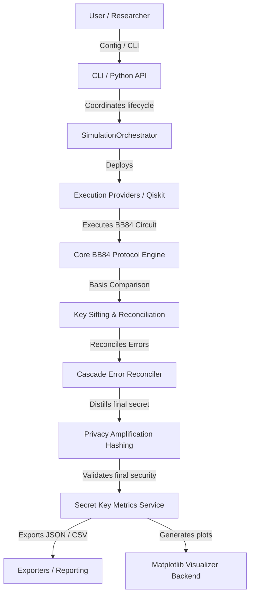
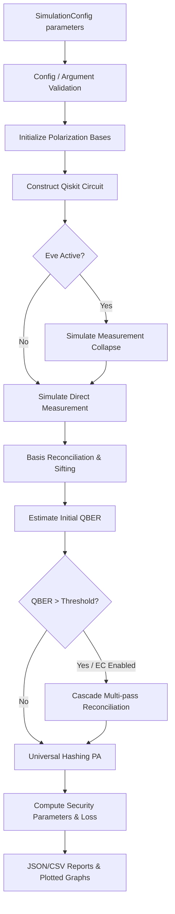

# 🌌 Quantum Security Toolkit (QST)

```text
      ___           ___           ___     
     /\  \         /\  \         /\  \    
    /::\  \       /::\  \        \::\  \   
   /:/\:\  \     /:/\ \  \        \::\  \  
  /:/  \:\  \   _\:\~\ \  \       /::/  /  
 /:/__/ \:\__\ /\ \:\ \ \__\     /:/  /    
 \:\  \  \/__/ \:\ \:\ \/__/    /:/  /     
  \:\  \        \:\ \:\__\     /:/  /      
   \:\  \        \:\/:/  /     \/__/       
    \:\__\        \::/  /                  
     \/__/         \/__/                   
```

The **Quantum Security Toolkit (QST)** is a modular, enterprise-grade simulation, analysis, and validation framework for Quantum Key Distribution (QKD) protocols. Built on top of IBM's Qiskit, QST allows security researchers, network engineers, and students to model quantum networks, evaluate the impact of eavesdroppers, and run statistical parameter sweeps in clean, reproducible environments.

[](https://www.python.org/)
[](./LICENSE)
[](#)
[](#)
[](#)
[](#)
[](https://github.com/psf/black)
[](#-documentation)
[](#)

---

## 🗺️ Table of Contents
1. [🌟 Features](#-features)
2. [📷 Screenshots / Demo](#-screenshots--demo)
3. [📐 Architecture Diagram](#-architecture-diagram)
4. [🔄 Project Workflow](#-project-workflow)
5. [📂 Project Structure](#-project-structure)
6. [📦 Installation](#-installation)
7. [🚀 Quick Start](#-quick-start)
8. [💻 CLI Usage](#-cli-usage)
9. [🐍 Python API Usage](#-python-api-usage)
10. [📚 Examples](#-examples)
11. [⚙️ Configuration](#-configuration)
12. [🏛️ Architecture Overview](#%EF%B8%8F-architecture-overview)
13. [🛠️ Technology Stack](#%EF%B8%8F-technology-stack)
14. [📊 Benchmarks](#-benchmarks)
15. [📅 Roadmap](#-roadmap)
16. [📖 Documentation](#-documentation)
17. [🤝 Contributing](#-contributing)
18. [🛡️ Security](#%EF%B8%8F-security)
19. [🧪 Testing](#-testing)
20. [📅 Release Information](#-release-information)
21. [🏷️ Citation](#%EF%B8%8F-citation)
22. [📜 License](#-license)
23. [💖 Acknowledgements](#-acknowledgements)
24. [✉️ Footer](#%EF%B8%8F-footer)

---

## 🌟 Features

| Feature | Category | Icon | Description |
| :--- | :--- | :---: | :--- |
| **BB84 Protocol Engine** | Quantum Core | ⚛️ | Simulates Alice's state preparation, Bob's measurements, sifting, and QBER calculations. |
| **Eve Simulation** | Threat Model | 🕵️ | Simulates quantum state collapse caused by measurement intercepts with adjustable probability. |
| **Cascade Error Correction** | Reconciliation | 🧩 | Multi-pass recursive parity block calculations to correct errors without modifying sifted arrays. |
| **Privacy Amplification** | Cryptography | 🔒 | Compress reconciled keys using universal Toeplitz matrix hashing; calculates Min-Entropy bounds. |
| **IBM Quantum Integration** | Execution Routing | 🌐 | Run circuits on physical QPUs or remote simulators using Qiskit Runtime Service with Aer fallback. |
| **Scientific Visualizer** | Analytics | 📈 | Light, dark, and scientific themes supporting PNG, SVG, and PDF vector exports. |

---

## 📷 Screenshots / Demo

### Command-Line Execution
*Terminal rendering output during parameter sweeps:*
```text
[Placeholders: CLI execution demonstration showing 'qst sweep' logs and live throughput measurements]
```

### Visualizer Plot Output
*Example of QBER vs. Interception Probability trend analysis:*
```text
[Placeholders: Matplotlib visualizer output showing error rate trends under dark and light styling themes]
```

---

## 📐 Architecture Diagram



---

## 🔄 Project Workflow



---

## 📂 Project Structure

```text
qst/
├── .github/
│   ├── workflows/            # GitHub actions for build, test, lint, and security scan
│   ├── ISSUE_TEMPLATE/       # Templates for bug reports and feature requests
│   └── pull_request_template.md
├── Docs/                     # Detailed guides and manuals
├── src/qst/
│   ├── core/                 # Quantum circuits, sifting, QBER, and Eve simulation
│   ├── correction/           # Cascade error correction algorithms and parity models
│   ├── privacy/              # Toeplitz hashing and Min-Entropy estimations
│   ├── secret/               # Rates metrics calculators and summary builders
│   ├── orchestration/        # Run schedulers and parameter sweep loops
│   ├── reporting/            # CSV, JSON exporters and serializers
│   ├── visualization/        # Themes registry and Matplotlib rendering backend
│   └── cli/                  # CLI commands entrypoints
├── tests/                    # Unit, integration, property, and benchmark suites
├── examples/                 # Execution tutorials
├── notebooks/                # Jupyter notebook tutorials
└── pyproject.toml            # Package metadata and PEP-518 dependencies
```

---

## 📦 Installation

### 1. Requirements
* Python `>=3.10`
* Operating Systems: Windows, macOS, Linux (Fully cross-platform)

### 2. Standard Installation
Create a virtual environment and install QST in editable mode:
```bash
python -m venv .venv
source .venv/bin/activate  # Windows: .venv\Scripts\activate
pip install -e .
```

### 3. Full Installation (with Visualization features)
To enable vector scientific plot exports:
```bash
pip install -e ".[viz]"
```

---

## 🚀 Quick Start

Run a simple noise-free BB84 simulation trial in Python:

```python
from qst.models.config import SimulationConfig
from qst.orchestration.orchestrator import SimulationOrchestrator

# Initialize configuration
config = SimulationConfig(
    n_qubits=20,
    seed=42,
    repetitions=1
)

# Run simulation
orchestrator = SimulationOrchestrator()
result = orchestrator.run_once(config)
trial = result.simulations[0]

print(f"Sifted Key length: {trial.final_key_length}")
print(f"Computed QBER:     {trial.qber}")
```

---

## 💻 CLI Usage

QST exposes a command line interface to run trials, sweeps, and exports.

### Command Help
```bash
qst --help
```

### Single Simulation CLI
```bash
qst simulate --qubits 20 --seed 123 --interception-probability 0.05 --output trial.json
```

### Parameter Sweep CLI
```bash
qst sweep --qubits 10,20 --interception 0.0,0.1 --output sweep.json
```

---

## 🐍 Python API Usage

```python
from qst.models.config import SimulationConfig
from qst.correction.models import CascadeConfiguration
from qst.privacy.models import PrivacyAmplificationConfiguration
from qst.orchestration.orchestrator import SimulationOrchestrator

# Initialize comprehensive configuration
config = SimulationConfig(
    n_qubits=30,
    seed=42,
    run_error_correction=True,
    cascade_configuration=CascadeConfiguration(block_sizes=(8, 16)),
    run_privacy_amplification=True,
    privacy_configuration=PrivacyAmplificationConfiguration(compression_ratio=0.6)
)

orchestrator = SimulationOrchestrator()
result = orchestrator.run_once(config)

trial = result.simulations[0]
print(f"Corrected Key: {trial.corrected_key}")
print(f"Final Secret Key: {trial.final_secret_key.key_bits}")
print(f"Min-Entropy Parameter: {trial.final_secret_key.min_entropy_estimate}")
```

---

## 📚 Examples

| Tutorial Script | Difficulty | Est. Time | Key Concepts Demonstrated |
| :--- | :--- | :--- | :--- |
| [`01_basic_bb84.py`](./examples/01_basic_bb84.py) | Beginner | 2 mins | Config initialization, orchestrator run_once, console reporting |
| [`02_eavesdropper_demo.py`](./examples/02_eavesdropper_demo.py) | Intermediate | 3 mins | Eavesdropping intercepts, quantum state collapse explanation, QBER rise |
| [`03_parameter_sweep.py`](./examples/03_parameter_sweep.py) | Intermediate | 4 mins | Config sweeps generation, sweeps execution, statistical aggregations |
| [`04_export_results.py`](./examples/04_export_results.py) | Intermediate | 3 mins | Serializers, JSONExporter, CSVExporter, schema load verification |
| [`05_visualization.py`](./examples/05_visualization.py) | Intermediate | 4 mins | Visualizer, MatplotlibBackend, themes, multi-format plots (PNG, SVG, PDF) |
| [`06_complete_pipeline.py`](./examples/06_complete_pipeline.py) | Advanced | 5 mins | E2E sweeps, trend analysis, scientific plotting, serialization, JSON/CSV exports |
| [`07_real_hardware_execution.py`](./examples/07_real_hardware_execution.py) | Intermediate | 3 mins | IBM Quantum Runtime execution, backend selection, and Aer fallback |
| [`08_error_correction.py`](./examples/08_error_correction.py) | Intermediate | 3 mins | Cascade Error Correction integration, key reconciliation metrics |
| [`09_privacy_amplification.py`](./examples/09_privacy_amplification.py) | Intermediate | 3 mins | Privacy Amplification, key compression ratio metrics, Min/Shannon Entropy |
| [`10_protocol_summary.py`](./examples/10_protocol_summary.py) | Intermediate | 3 mins | Protocol Finalization, E2E key rates summary, classification levels, and losses |

---

## ⚙️ Configuration

| Configuration Attribute | Type | Default | Description |
| :--- | :---: | :---: | :--- |
| `n_qubits` | `int` | *Required* | Number of raw qubits generated in the quantum polarization stage. |
| `seed` | `Optional[int]` | `None` | Seed value for deterministic pseudorandom matrix and block shuffles. |
| `interception_probability` | `float` | `0.0` | Probability that Eve intercepts and measures a qubit during transit. |
| `run_error_correction` | `bool` | `False` | Enables/disables the Cascade Error Correction process. |
| `run_privacy_amplification` | `bool` | `False` | Enables/disables the Privacy Amplification hashing stage. |
| `use_ibm_runtime` | `bool` | `False` | Routes circuit execution to remote IBM Quantum hardware when set to `True`. |

---

## 🏛️ Architecture Overview

The toolkit's modular packaging aligns with strict **SOLID design principles**:
* **Dependency Inversion:** Execution backends implement `ExecutorInterface`, allowing simulators (Aer) and physical hardware (IBM QPU Runtime) to be swapped transparently.
* **Single Responsibility:** Cryptographic, error reconciliation, and mathematical metric calculations are separated from runtime orchestration loops.
* **Interface Segregation:** Hashing algorithms inherit from the generic `HashAlgorithm` contract, isolating Toeplitz implementations.

---

## 🛠️ Technology Stack

| Component | Library / Framework | Version |
| :--- | :--- | :---: |
| **Language** | Python | `>=3.10` |
| **Quantum Physics Simulator** | Qiskit / Qiskit Aer | `>=1.0.0` |
| **Array Computing** | NumPy | `>=1.24.0` |
| **Testing Backend** | pytest / pytest-cov | `>=7.0.0` |
| **Code Formatting** | black / ruff | Modern release |
| **Plotting Engine (Optional)** | Matplotlib | `>=3.7.0` |

---

## 📊 Benchmarks

*Measurements collected on Qiskit Aer statevector simulators (CPU: Intel i7 / Ryzen 7 equivalents):*

| Key Size (Qubits) | Execution Time (ms) | Peak Memory (KiB) |
| :--- | :---: | :---: |
| 5 | 3889.86 | 37471.42 |
| 10 | 577.50 | 265.70 |
| 15 | 544.66 | 249.99 |
| 20 | 626.51 | 239.79 |
| 25 | 1040.11 | 232.73 |

### Scalability Limits
* **Simulator Bounds:** Local simulations using standard coupling maps are bounded to $N \le 29$ qubits.
* **Transpiler Warning:** Requesting $N > 29$ qubits raises transpilation validation errors.

---

## 📅 Roadmap

### Completed Milestones
- [x] **Phase 1-11 (Foundations & CLI):** Polarization state preps, basis reconciliation sifting, visualizer registry, JSON/CSV sweeps, and command line tools.
- [x] **Phase 12 (IBM Integration):** Least-busy QPU discoverer, remote simulator execution, and automatic Aer fallbacks.
- [x] **Phase 13A (Cascade EC):** Multi-pass Cascade error correction.
- [x] **Phase 13B (Privacy Amplification):** 2-universal Toeplitz hashing matrices generators, Shannon/Min-entropy estimators, and trace distance bounds computations.
- [x] **Phase 13C (Protocol Finalization):** Dedicated calculators and summaries, security level thresholds.
- [x] **Phase 14 (Release Engineering):** Version freezes, packaging setup, supply-chain workflows, and complete guides.

---

## 📖 Documentation

Detailed guides and specifications are available under the `Docs/` directory:
* 📖 **[User Guide](./Docs/User_Guide.md)** — Installation methods, configuration settings, and quick start scripts.
* 📐 **[Architecture Guide](./Docs/Architecture.md)** — Core module designs and end-to-end QKD pipeline data flows.
* 📝 **[API Reference](./Docs/API_Reference.md)** — Configuration dataclasses and orchestrator/service method signatures.
* 🛠️ **[Troubleshooting](./Docs/Troubleshooting.md)** — Diagnostic steps for `QST-VAL-*` and `QST-SIM-*` error codes.
* 📊 **[Benchmark Report](./Docs/Benchmark_Report.md)** — Execution timings, memory usage statistics, and reproducibility baselines.
* 📅 **[Future Roadmap](./Docs/Roadmap.md)** — Completed phases milestones and target feature roadmap for subsequent versions.
* ❓ **[FAQ](./Docs/FAQ.md)** — Frequently asked questions regarding local simulator bounds and customization plugins.

---

## 🤝 Contributing

We welcome contributions to the Quantum Security Toolkit! Please read our [Contributing Guide](./CONTRIBUTING.md) and [Code of Conduct](./CODE_OF_CONDUCT.md) for details on code style guidelines, formatting, testing targets, and pull request submission steps.

---

## 🛡️ Security

Please review [`SECURITY.md`](./SECURITY.md) for information regarding vulnerability reporting channels and security disclosures policies.

---

## 🧪 Testing

Execute the test suites using pytest:
```bash
python -m pytest
```

Verify type annotations:
```bash
mypy src/
```

Verify formatting and linting:
```bash
black --check src/
ruff check src/
```

---

## 📅 Release Information

This project adheres to **Semantic Versioning (SemVer)**:
* **Stable public APIs** (defined in `Docs/API_Reference.md`) are frozen for the `v1.x` release series. No breaking modifications will be introduced.
* Detailed historical updates are tracked in the [`CHANGELOG.md`](./CHANGELOG.md).

---

## 🏷️ Citation

For academic or research citation, please reference the CITATION metadata:
```bibtex
@software{qst_toolkit,
  author = {QST Authors},
  title = {Quantum Security Toolkit (QST)},
  version = {1.0.0},
  year = {2026},
  url = {https://github.com/shlok926/Project-Q-30-Days-Challenge}
}
```
*Note: Refer to [`CITATION.cff`](./CITATION.cff) for full CFF formats.*

---

## 📜 License

This project is licensed under the MIT License - see the [`LICENSE`](./LICENSE) file for details.

---

## 💖 Acknowledgements
* IBM Qiskit and Qiskit Aer simulation teams.
* Charles Bennett and Gilles Brassard (BB84 Protocol inventors).
* Cascade error correction protocol research authors.

---

## ✉️ Footer

<p align="center">
  Made with ❤️ by the Quantum Security Toolkit Authors. <br>
  For support, email us at <a href="mailto:support@qst-project.org">support@qst-project.org</a>. <br>
  © 2026 QST Authors. All rights reserved.
</p>
