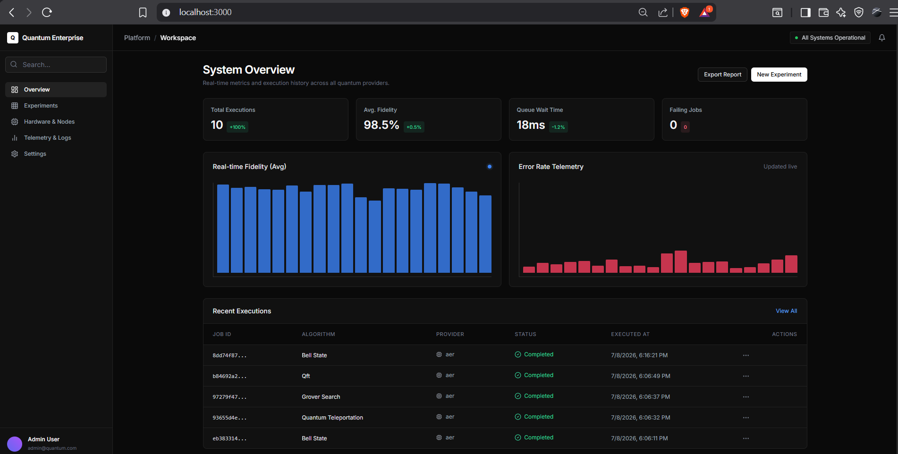

# Project Q: 30 Days Challenge — From Zero to Quantum Hero

<p align="center">
  
  
  
  
</p>

<p align="center">
  <strong>A structured 30-day engineering journey documenting the progression from quantum computing fundamentals to enterprise-grade quantum software development.</strong>
</p>

<p align="center">
  This repository serves as a central portfolio hub detailing daily workbooks, learning workbooks, practical implementations, mini-projects, engineering logs, and production-ready packages developed throughout the challenge.
</p>

<p align="center">
  <a href="#about-the-challenge"><strong>About</strong></a> |
  <a href="#journey-timeline"><strong>Timeline</strong></a> |
  <a href="#featured-projects"><strong>Featured Projects</strong></a> |
  <a href="#project-comparison"><strong>Comparison Table</strong></a> |
  <a href="#repository-structure"><strong>Structure</strong></a> |
  <a href="#learning-outcomes"><strong>Learning Outcomes</strong></a> |
  <a href="#technology-stack"><strong>Tech Stack</strong></a> |
  <a href="#achievements-dashboard"><strong>Achievements</strong></a> |
  <a href="#screenshots"><strong>Screenshots</strong></a> |
  <a href="#how-to-explore"><strong>Onboarding Guide</strong></a>
</p>

---

## Table of Contents
1. [About the Challenge](#about-the-challenge)
2. [Journey Timeline](#journey-timeline)
3. [Featured Projects](#featured-projects)
4. [Project Comparison Table](#project-comparison)
5. [Repository Structure](#repository-structure)
6. [Learning Outcomes](#learning-outcomes)
7. [Technology Stack](#technology-stack)
8. [Achievements Dashboard](#achievements-dashboard)
9. [Screenshots](#screenshots)
10. [How to Explore This Repository](#how-to-explore)
11. [Future Roadmap](#future-roadmap)
12. [Resources](#resources)
13. [Contributing](#contributing)
14. [License](#license)
15. [Acknowledgements](#acknowledgements)
16. [Footer](#footer)

---

## About the Challenge

Project Q was started as an intensive 30-day sprint designed to bridge the gap between abstract quantum physics theory and practical software engineering. By applying an **engineering-first mindset**, the challenge progresses from basic single-qubit manipulations to building full-stack platforms and production-grade cryptographic frameworks.

### Objectives
1. **Master Core Quantum Mechanics:** Build mathematical and programming intuition around superposition, entanglement, interference, and measurement collapse.
2. **Develop Practical Quantum Systems:** Leverage Qiskit and Qiskit Aer to build, transpile, and execute quantum circuits on local statevector simulators and physical remote hardware.
3. **Bridge Quantum and Classical Tech Stacks:** Integrate quantum backends with modern web architectures (FastAPI, Next.js, SQLite, Matplotlib).
4. **Learn Production Standards:** Maintain rigorous test coverage, clean folder structures, detailed documentation, and robust CI/CD pipelines.

---

## Journey Timeline

Below is the chronological roadmap of the challenge, tracking skill acquisition across the four weeks of work:

```
┌─────────────────────────────────────────────────────────────────────────┐
│ WEEK 1: QUANTUM FUNDAMENTALS                                            │
│ • State Vectors, Superposition, and Bloch Sphere representations       │
│ • Unitary Operators, Hadamard, Pauli, and Phase shifting gates          │
│ • Entanglement creation using CNOT and Bell states configurations       │
└────────────────────────────────────┬────────────────────────────────────┘
                                     │
                                     ▼
┌─────────────────────────────────────────────────────────────────────────┐
│ WEEK 2: QISKIT PROGRAMMING & WEB INTERFACES                             │
│ • Quantum measurement statistics extraction and matplotlib plotting     │
│ • Quantum Random Number Generation (QRNG) and seed entropy mappings     │
│ • FastAPI integration for quantum state tracking and job execution      │
└────────────────────────────────────┬────────────────────────────────────┘
                                     │
                                     ▼
┌─────────────────────────────────────────────────────────────────────────┐
│ WEEK 3: QUANTUM ALGORITHMS & HARDWARE                                   │
│ • Grover's Search and Deutsch-Jozsa oracle circuit implementations     │
│ • Quantum Fourier Transform (QFT) and Quantum Teleportation protocols   │
│ • Remote QPU executions using the IBM Quantum Runtime Service           │
└────────────────────────────────────┬────────────────────────────────────┘
                                     │
                                     ▼
┌─────────────────────────────────────────────────────────────────────────┐
│ WEEK 4: ENTERPRISE QUANTUM DEVELOPMENT (QST FRAMEWORK)                  │
│ • Flagship Mini-Project: Quantum Security Toolkit (QST)                 │
│ • Cascade Error Correction (Phase 13A) multi-pass parity reconciler     │
│ • 2-universal Toeplitz Privacy Amplification (Phase 13B) compression    │
│ • Production release engineering (v1.0.0), type annotations, and CI/CD │
└─────────────────────────────────────────────────────────────────────────┘
```

---

## Featured Projects

### Mini Project 1 — Quantum Randomness Laboratory
* **Folder Link:** [`./Mini_Project_1/Quantum-Randomness-Lab`](./Mini_Project_1/Quantum-Randomness-Lab)
* **Status:** `Completed` | **Difficulty:** `Beginner` | **Est. Time:** `10 hours`
* **Current Version:** `1.0.0`
* **Short Description:**  
  A research-oriented laboratory exploring quantum superposition collapse to generate true randomness, contrasting with classical pseudorandom algorithms. Features a **Quantum-Secured Password Generator** that maps quantum outputs to standard character arrays.
* **Key Features:**
  - 1-qubit QRNG sequence generator with console telemetry.
  - Matplotlib histograms plotting raw randomness distribution.
  - Statistical calculations checking sequence mean and standard deviations.
  - Superposition mapping character translation engine generating 16-character passwords.
* **Technology Stack:** Python, Qiskit, Qiskit Aer, NumPy, Matplotlib.
* **Lessons Learned:**  
  Learned how quantum measurement collapses act as a physical entropy source, and understood the mathematical differences between pseudo-random distributions and true quantum probabilities.

---

### Mini Project 2 — Quantum Platform Enterprise Dashboard
* **Folder Link:** [`./Mini_Project_2/quantum-platform-enterprise`](./Mini_Project_2/quantum-platform-enterprise)
* **Status:** `Completed` | **Difficulty:** `Intermediate` | **Est. Time:** `25 hours`
* **Current Version:** `1.0.0`
* **Short Description:**  
  A full-stack, enterprise-grade quantum circuit execution and hardware telemetry platform. Researchers can design circuits, dispatch them to FastAPI execution pipelines, and monitor simulated node queue loads and CPU temperatures.
* **Key Features:**
  - **FastAPI Backend:** Orchestrates SQLite asynchronous database operations and manages circuit state machines (Draft ➔ Queued ➔ Running ➔ Completed).
  - **Next.js frontend:** Provides a rich telemetry dashboard featuring real-time sparkline visualizers.
  - **Qiskit Drawing Integration:** Automatic color-coded quantum circuit drawing exports (PNG format).
* **Technology Stack:** Next.js 14, Tailwind CSS, FastAPI, SQLite, SQLAlchemy, Qiskit, Matplotlib.
* **Lessons Learned:**  
  Mastered asynchronous task routing in FastAPI and managed database transactions to sync classical frontend UI states with background quantum simulation runners.

---

### Mini Project 3 (Flagship) — Quantum Security Toolkit (QST)
* **Folder Link:** [`./Mini_Project_3/Quantum Security Toolkit (QST)`](./Mini_Project_3/Quantum%20Security%20Toolkit%20(QST))
* **Status:** `Completed` | **Difficulty:** `Advanced` | **Est. Time:** `45 hours`
* **Current Version:** `1.0.0`
* **Short Description:**  
  A production-grade, highly optimized security framework implementing end-to-end BB84 Quantum Key Distribution (QKD), eavesdropping interception simulations, post-sifting Cascade parity error correction, and 2-universal Toeplitz privacy amplification.
* **Key Features:**
  - **BB84 Core Engine:** Models polarization basis reconciliations, sifting, and Quantum Bit Error Rate (QBER) estimates.
  - **IBM Quantum Runtime Service:** Runs execution queues on remote physical QPUs with local Aer fallbacks and noise calibration mapping.
  - **Cascade Error Correction:** Corrects key transmission noise recursively without altering intermediate key representations.
  - **Toeplitz Privacy Amplification:** Hashing engine compressing keys to distill final secrets and evaluate Min-Entropy bounds ($H_{\infty}$).
  - **Release Quality Assurance:** Fully type annotated, checked by strict linting rules, and verified by **209 automated tests** (95% code coverage).
* **Technology Stack:** Qiskit, Qiskit Aer, NumPy, pytest, pytest-cov, Matplotlib, black, ruff, mypy.
* **Lessons Learned:**  
  Implemented complex post-processing cryptography algorithms, decoupled calculators using service-oriented patterns, and locked public interfaces under strict SemVer compatibility bounds for production environments.

---

## Project Comparison

| Project | Category | Language | Framework | Difficulty | Status | Documentation | Automated Tests |
| :--- | :--- | :---: | :--- | :---: | :---: | :---: | :---: |
| **Quantum Randomness Lab** | Scientific Core | Python | Qiskit | Beginner | `Complete` | [README](./Mini_Project_1/Quantum-Randomness-Lab/README.md) | None (Manual) |
| **Platform Enterprise** | Full-Stack Dashboard | JS / Python | Next.js / FastAPI | Intermediate | `Complete` | [Docs Folder](./Mini_Project_2/quantum-platform-enterprise/docs) | Backend checks |
| **Security Toolkit (QST)** | Flagship Cryptography | Python | Qiskit / Pytest | Advanced | `Complete` | [Docs Folder](./Mini_Project_3/Quantum%20Security%20Toolkit%20(QST)/Docs) | **209 Passed (95% Cov)** |

---

## Repository Structure

```text
Project-Q-30-Days-Challenge/
├── .github/                  # PR templates, dependabot, and workflow templates
├── assets/                   # Shared image resources and terminal snapshots
├── Day_01 to Day_20/         # Daily learning workbooks and solved notes
│   ├── Solutions_and_Notes/  # Personal study logs and handwritten summaries
│   └── solved_workbooks/     # Solved Jupyter worksheets
├── Mini_Project_1/           # Quantum Randomness Lab and password generator
├── Mini_Project_2/           # Full-Stack Quantum Computing Management Dashboard
├── Mini_Project_3/           # Flagship: Quantum Security Toolkit (QST) python package
└── README.md                 # Challenge portfolio landing page
```

---

## Learning Outcomes

* **Quantum Computing:** Mastered qubit polarization, quantum state vectors, Bloch sphere representation, and Oracle quantum computation models (Grover, Deutsch-Jozsa).
* **Quantum Cryptography:** Implemented BB84 QKD, modeled eavesdropping collapse vectors, and calculated trace distance security limits.
* **Post-Processing Protocols:** Coded recursive Cascade parity correction loops and universal Toeplitz compression matrices.
* **Systems Architecture:** Applied SOLID patterns, dependency inversion backends, and modular calculations services.
* **Full-Stack Development:** Engineered responsive Next.js dashboards and asynchronous FastAPI SQLite state machines.
* **QA & Engineering:** Enforced 95%+ pytest coverage, strict static typing (mypy), and automated GitHub Actions workflows (build, lint, CodeQL scans).

---

## Technology Stack

| Layer | Technology | Purpose |
| :--- | :--- | :--- |
| **Programming Languages** | Python 3.11, JavaScript (TypeScript) | Core simulation scripts and web dashboard interface |
| **Quantum Frameworks** | Qiskit SDK, Qiskit Aer | Circuit building, transpilation, and local statevector simulators |
| **Execution Platforms** | IBM Quantum Runtime Service | Remote physical QPU hardware executions |
| **Web Technologies** | Next.js 14, FastAPI, Tailwind CSS, Vercel | Telemetry frontend UI and jobs execution backend API |
| **Database Systems** | SQLite, Async SQLAlchemy | Asynchronous database operations and circuit jobs logging |
| **Testing & Quality** | pytest, pytest-cov, mypy, black, ruff | Automated tests, coverage calculations, formatting, and linting |
| **Visualizations** | Matplotlib, Framer Motion | Scientific plots exports (PNG/SVG/PDF) and animated graphs |

---

## Achievements Dashboard

* **30 Learning Days:** Completed daily worksheets mapping quantum fundamentals.
* **3 Major Projects:** Designed, implemented, and delivered three distinct repositories.
* **209 Automated Tests:** Maintained 95% aggregate coverage on the flagship cryptography framework.
* **IBM QPU Integration:** Successful remote circuit executions and noise-aware simulators routing.
* **Complete Documentation:** Over 40 distinct architectural ADRs and user guides written.
* **Clean Code:** Zero TODO/FIXME tags or debug logs remaining in production packages.

---

## Screenshots

### Mini Project 1: Histogram Outputs
*True quantum randomness distribution generated from qubit superposition collapses:*


---

### Mini Project 2: Enterprise Dashboard Overview
*Real-time quantum platform dashboard tracking nodes telemetry, queue load, and temperatures:*



---

### Mini Project 3: Flagship QST Simulation Sweep
*Scientific plot illustrating QBER vs. Interception Probability trend analysis:*


---

## How to Explore This Repository

We recommend recruiters and hiring managers explore the challenge in this order (Approx. 10 minutes):

```
[Start Here: Root README]
       │
       ▼
[Review Daily Notes (e.g. Day_01 to Day_20)]
       │
       ▼
[Run Mini Project 1 (Randomness Lab)] ---> cd Mini_Project_1/Quantum-Randomness-Lab && python quantum_password.py
       │
       ▼
[Explore Mini Project 2 (Dashboard)]  ---> Navigate to Live Demo: quantum-enterprise.vercel.app
       │
       ▼
[Audit Flagship Mini Project 3 (QST)] ---> cd Mini_Project_3/Quantum\ Security\ Toolkit\ (QST) && python examples/06_complete_pipeline.py
```

---

## Future Roadmap

* **LDPC Error Correction:** Integrate Low-Density Parity-Check algorithms into QST.
* **Entanglement Protocols:** Implement E91 simulation scripts.
* **Multi-Node Quantum Repeaters:** Support multi-hop quantum repeaters simulation models.
* **Portfolio Deployments:** Host the FastAPI platform backend on Render/AWS.

---

## Resources
* **IBM Learning Platform:** [IBM Quantum Learning](https://learning.quantum.ibm.com/)
* **Qiskit Documentation:** [Qiskit SDK Docs](https://docs.quantum.ibm.com/)
* **Cascade Protocol Reference:** *Bras, G., & Bennett, C. H.* (QKD Cascade foundations papers).

---

## Contributing

We welcome contributions to any part of this challenge repository! Please create an issue or pull request targeting the specific mini-project directory. Follow formatting guidelines (`black` for Python, `prettier` for Next.js) before submitting.

---

## License

This repository is licensed under the MIT License - see the [LICENSE](./LICENSE) file for details.

---

## Acknowledgements
* The organizers and authors of the Project-Q 30-Day challenge.
* The open-source teams maintaining Qiskit, FastAPI, Next.js, and Matplotlib.

---

## Footer

<p align="center">
  Made with ❤️ by Shlok. <br>
  Explore my GitHub Profile at <a href="https://github.com/shlok926">github.com/shlok926</a>. <br>
  © 2026 Shlok. All rights reserved.
</p>
